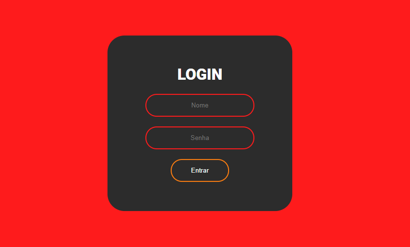

# Mini projetos em css
 
 Pequenos projetos desenvolvidos em CSS para estudos em Web Design.

## Site em login
* Exemplo de login em um site.
>Com entrada de usuário, senha e um botão de entrar, tudo dentro de um quadrado centralizado.

## Barra de Pesquisa
* Exemplo de uma barra de pesquisa.
>Barra fica esondida em um icone de lupa, sempre que passar o mouse por cima abrirá a barra para digiar.

